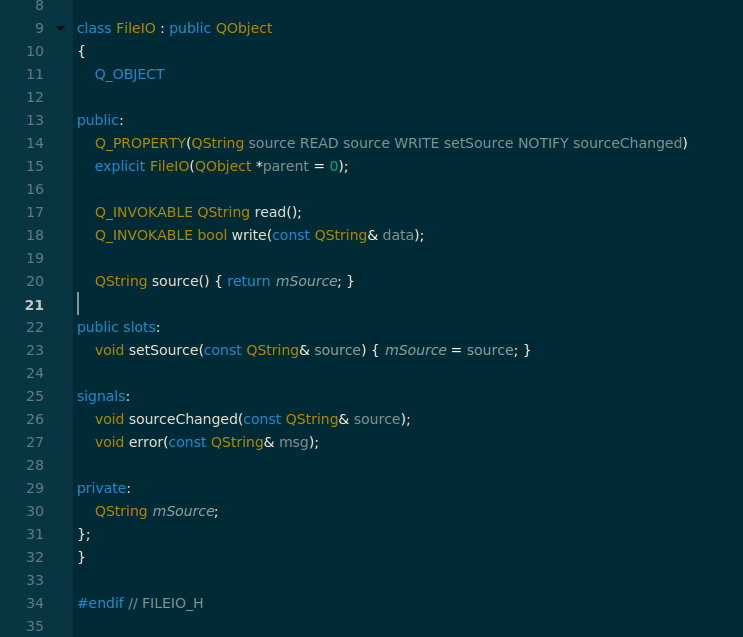
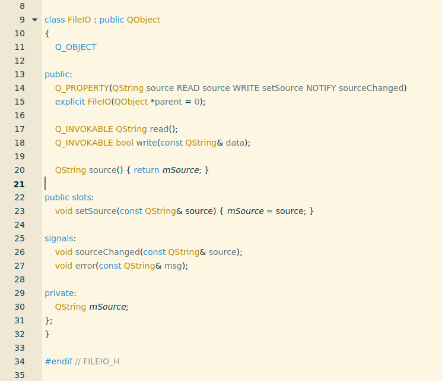
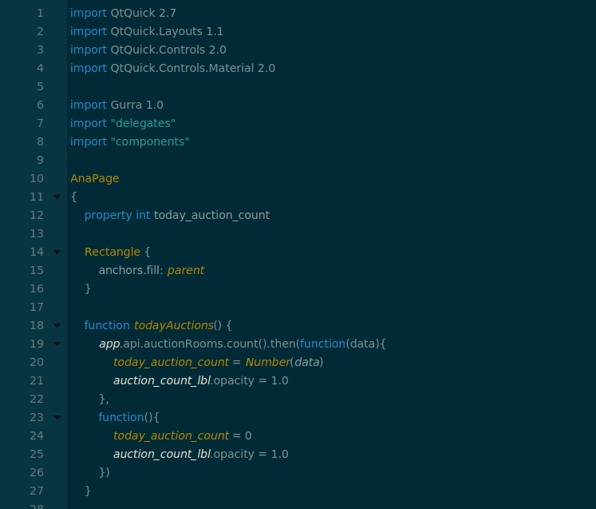
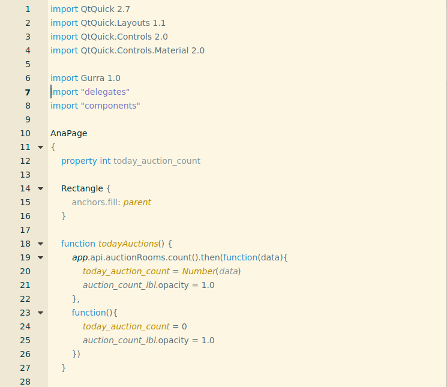

# Qt Creator Solarized
a QtCreator color scheme based on http://ethanschoonover.com/solarized

# Installation
Copy `solarized.xml` and `solarized_light.xml` files which defines the colors for syntax highlighting to the styles directory of Qt Creator. On linux the path to this directory is `~/.config/QtProject/qtcreator/styles`.

# Screenshots

### C++ Source
#### Dark

#### Light

### QML Source
#### Dark

#### Light

